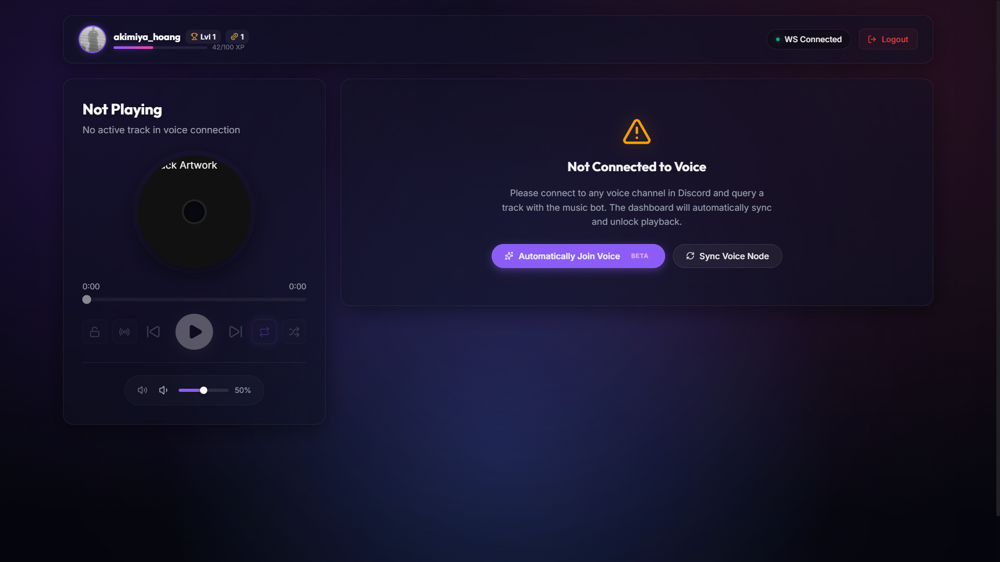
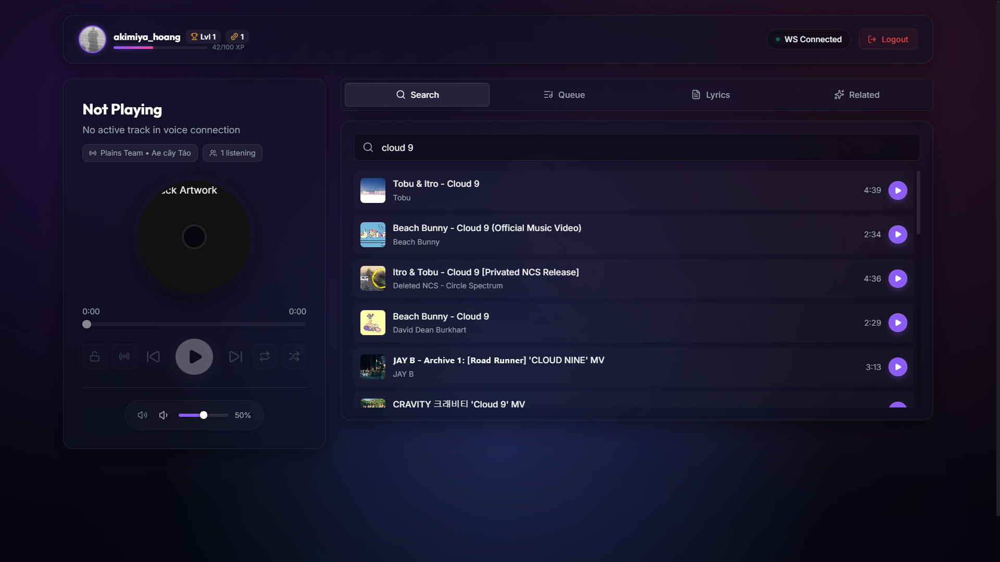
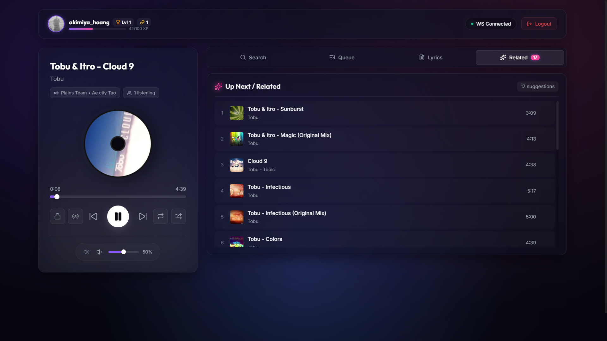
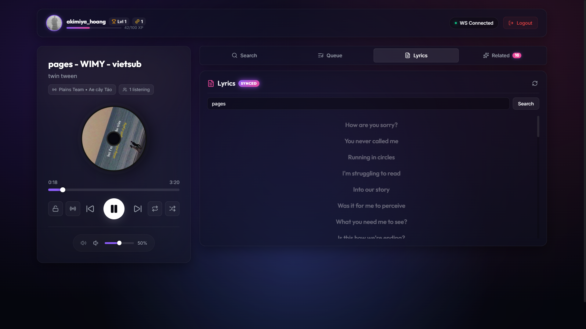

# garet-player

> Discord music bot player

     

## 📋 Table of Contents

- [Features](#features)
- [Installation](#installation)
- [Screenshots](#screenshots)

## ℹ️ Project Information

- **👤 Author:** akimiya7742
- **📦 Version:** 1.2.5
- **📄 License:** MIT
- **🌐 Website:** [https://garret-player.vercel.app](https://garret-player.vercel.app)
- **📂 Repository:** [https://github.com/akimiya7742/garet-player](https://github.com/akimiya7742/garet-player)
- **🏷️ Keywords:** discord-bot, nextjs

## Features

- Discord Authentication
- Control music player from any devices
- Support search / lyrics / queue / ...
- Automatically join voice (beta)
- Modern and sleek UI

## Installation

1. Clone the repository
```sh
git clone https://github.com/akimiya7742/garet-player
```
2. Install packages
```sh
npm install
```
3. Configure the environment variables
```
NEXT_PUBLIC_BACKEND_API_URL= # get from the main bot repository
```
4. Run the server
```
npm run dev
```

## Screenshots

<table>
  <tr>
    <td>
      
    </td>
    <td>
      
    </td>
  </tr>
  <tr>
    <td>
      
    </td>
    <td>
      
    </td>
  </tr>
</table>

